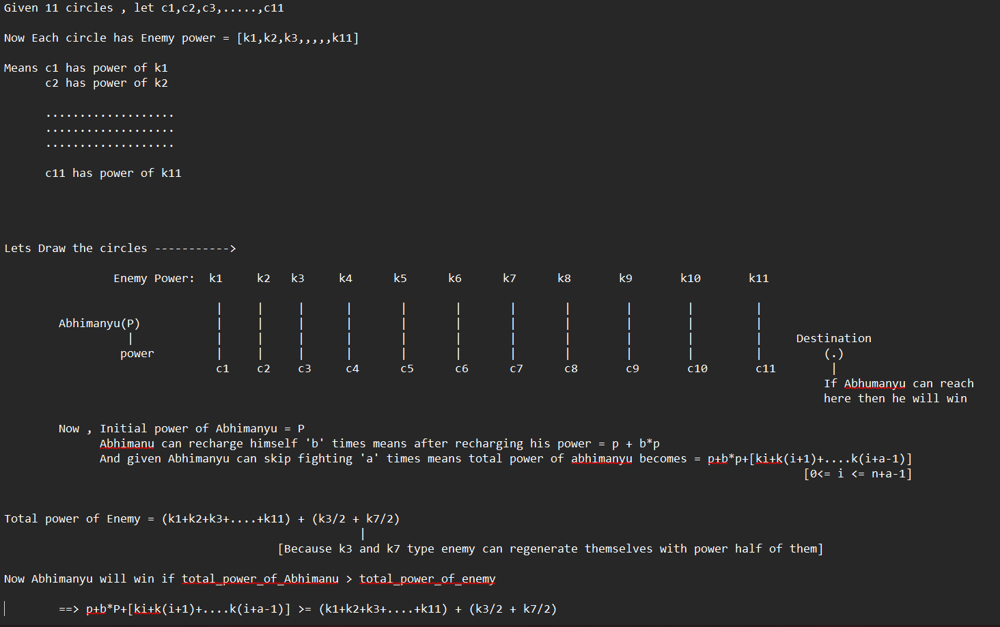

Mathematical Intuition:

* Time & Space Complexity analysis

    Time Complexity: O(n) where n is the number of circles (in this case, n = 11).
    Space Complexity: O(n) where n is the number of circles